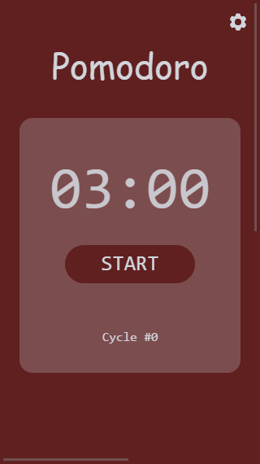
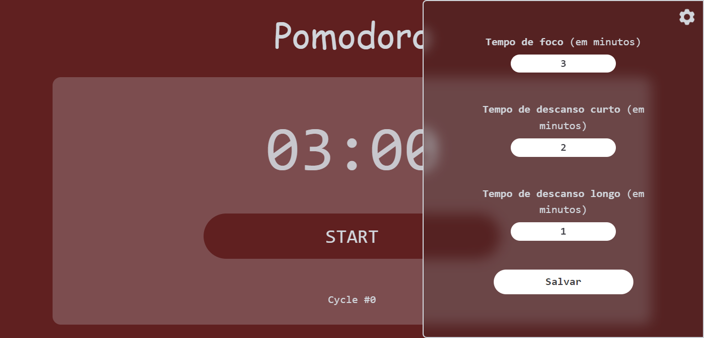

# Pomodoro

Ferramenta para auxiliar na aplicação do método Pomodoro. Controle seus ciclos de foco e descanso e aumente sua produtividade. 

## Acesse

<a href="https://pomodoro-caio.vercel.app/">Acesse a aplicação clicando aqui</a>.

## Construído com:

    


## Funcionalidades

:hammer_and_wrench: Permanência de dados da configuração utilizando localStorage; <br>
:gear: Animação na engrenagem e na sidebar; <br>
:monocle_face: Sidebar criada com técnica de glassmorphism; <br>
:loud_sound: Aviso sonoro ao fim de cada ciclo; <br>
:art: Mudança de cor de fundo proporcional ao tempo decorrido; <br>
:stopwatch: Cronômetro com 3 estágios: foco, pausa e descanso; <br>
:hash: Contagem de ciclos concluídos; <br>
:robot: Contador de tempo aparece na aba do navegador; <br>
:fountain_pen: Tipografia fluida

## Técnicas para prestar atenção

### Estrutura
O código estava estruturado em uma sequência de condicionais, o que dificultava a manutenção e mesmo o desenvolvimento em si do projeto. A criação de um objeto com as regras de cada etapa, e uma função que executa essas regras tornou o código mais legível e permitiu enxergar novas possibilidades de melhoria, como a criação da etapa "skip code".
O código era assim (ainda em estágio intermediário de desenvolvimento): 
```
if(controlButton.innerText==='START'){
      noticeToUser.innerText = "Concentre-se";
      controlButton.innerText = 'pause';
      timer.innerText = formatTime(timeLeft);
      cycleCount++;
      cycles.innerText = cycleCount;
      clearInterval(counter);
      clearTimeout(timeOut);
      counter = setInterval(() => {      
         
         
         bodyHue += rate;
         body.style.backgroundColor = `hsl(${bodyHue}, 50%, 25%)`;
         controlButton.style.backgroundColor = `hsl(${bodyHue}, 50%, 25%)`;    
         timeLeft--;
         timer.innerText = formatTime(timeLeft);
      }, "1000");

      setsCountdown();

   } else if(controlButton.innerText==='PAUSE'){
      noticeToUser.innerText = "Tempo pausado";
      controlButton.innerText = 'restart';      
      clearInterval(counter);
      clearTimeout(timeOut);

   } else if(controlButton.innerText==='RESTART'){
      noticeToUser.innerText = "Concentre-se";
      controlButton.innerText = 'pause';      

      counter = setInterval(() => {      
         bodyHue += rate;
         body.style.backgroundColor = `hsl(${bodyHue}, 50%, 25%)`;
         controlButton.style.backgroundColor = `hsl(${bodyHue}, 50%, 25%)`;   
         timeLeft--;
         timer.innerText = formatTime(timeLeft); 
      }, "1000");

      setsCountdown();
   
   } else if(controlButton.innerText==='REST'){
      noticeToUser.innerText = "Começou seu descanso";
      controlButton.innerText = 'start';
      let totalRestTime = cycleCount % 4 === 0 ? longerRestTime : restTime;
      let restTimeLeft = totalRestTime / 1000;
      timer.innerText = formatTime(restTimeLeft);
      counter = setInterval(() => {
         let restRate = 120/(totalRestTime/1000);
         bodyHue -= restRate;
         body.style.backgroundColor = `hsl(${bodyHue}, 50%, 25%)`;
         controlButton.style.backgroundColor = `hsl(${bodyHue}, 50%, 25%)`; 
         restTimeLeft--;
         timer.innerText = formatTime(restTimeLeft); 
      }, "1000");

      timeOut = setTimeout(() => {      
         console.log("Acabou o Descanso!");
         clearInterval(counter);
         noticeToUser.innerText = "Seu descanso acabou. Comece mais um foco"
      }, restTimeLeft * 1000);
   }
function setsCountdown(){
   timeOut = setTimeout(() =>
      {
         clearInterval(counter);
         noticeToUser.innerText = "Seu Pomodoro acabou. Descanse um pouco";
         controlButton.innerText = 'rest';
         timeLeft = totalTime / 1000;
      }, timeLeft * 1000);
} 

```
E foi estruturado como pode ser visto no arquivo pomodoroEngine.js.

### White-space
A seção de mensagem ao usuário, ainda que vazia, ocupa espaço na tela, permitindo uma quantidade menor de mudança de layout. Para isso utilizei a propriedade white-space com o valor pre-wrap (a classe utilitária whitespace-pre-wrap no Tailwind).

### Input text só aceita números
Utilização de input text para os valores numéricos da configuração, tendo em vista os problemas
 que o input number pode trazer (ver: https://css-tricks.com/what-to-use-instead-of-number-inputs/ ). Para lidar com isso, criei uma validação que impede o usuário de inserir qualquer caracter não numérico:
 ```
 const allowOnlyNumbers = value => value.replace(/[^0-9]+/, '');
 ```
Havia utilizado outra forma de checar se um valor era uma letra, mas símbolos e acentos não eram identificados
```
const isLetter = (character) => character.toLowerCase() != character.toUpperCase();
```

### Mudança de core de fundo
A mudança de cores do fundo havia sido estruturada da seguinte forma:
```
let percentageOfInterval = 100 - (((timeLeft*1000) / totalTime) * 100);
bodyHue = percentageOfInterval *1.2; 
```
Isso funcionava para partir do Hue 0, mas não funcionava para retornar para o ponto inicial.
Reestruturei o código utilizanto uma taxa e direção, o que permite lidar com situações como a volta à cor inicial, no caso da etapa 'break' e permitir que a cor final seja sempre a mesma em casos de pausa (em uma etapa do desenvolvimento a pausa reiniciava a mudança de cor, fazendo com que a cor de fundo variasse de acordo com a quantidade de pausas que o usuário fazia):
```
function changesBg(rate, direction){   
   direction === 'forward' ? bodyHue += rate : bodyHue -= rate;
   body.style.backgroundColor = `hsl(${bodyHue}, 50%, 25%)`;
   controlButton.style.backgroundColor = `hsl(${bodyHue}, 50%, 25%)`;
}
```
Precisei ainda criar uma animação que restabelece de forma gradativa a cor de fundo caso o usuário resolva pular o descanso ('skip rest'):
```
.restore{
   animation-name: backToRed;
   animation-duration: 1.5s;
   animation-timing-function: ease-in-out;
   animation-direction: normal;
   animation-fill-mode: forwards;
}

@keyframes backToRed{
   to{
      background-color: hsl(0, 50%, 25%)
   }
}
```

### Interação entre sidebar e funcinalidade principal

Criei um mecanismo para impedir que o temporizador funcione quando o menu de configurações lateral é aberto.
```
const handlePomodoroButton = () => {
   switch(controlButton.innerText){
      case 'START':
         break;
      case 'PAUSE':
         pomodoroEngine('PAUSE')
         break;
      case 'RESTART':
         !sidebarIsOpen && pomodoroEngine('RESTART')
         //Prevents pomodoro from restarting when user had paused it before opening configs, and having the time reunning while user was in configs
         break;
   }
}
```

### Operadores ternários
Utilização de operadores ternários e short-circuit evaluation para trazer mais concisão e legibilidade para o código.
e.g.:
```
const toggleTranslate = () => {
   sidebar.classList.toggle('translate-x-full');
   sidebarIsOpen ? sidebarIsOpen = false : sidebarIsOpen = true;
}
```

```
saveButton.addEventListener('click', e => {
   e.preventDefault();
   setDurations();
   controlButton.innerText==="RESTART" && cycleCount--; //if configs ae saved during a cycle, decreases cycle count before increasing in pomodoroEngine
   handleSidebar(gear);
   pomodoroEngine('START');
});
```

## Objetivo

O objetivo deste projeto foi desenvolver um sistema do Pomodoro em equipe durante o evento Live CoDe.

## Tarefas

- [x] Create timeout
- [x] Create Pomodoro activator
- [X] Conect Pomodoro activator through JS
- [x] Create total time controler
- [x] Create countdown per second
- [x] Calculate remaining time
- [x] Create timer element on screen
- [X] Make timer change according to countdown
- [X] Control time, and after 25 minutes let user know time is out
- [X] Button to pause and get back
- [X] Button for interval
- [X] Show count of cycles
- [X] After 4, long pause
- [X] Change bg color according to mode
- [X] Change happens gradually
- [X] Style with Tailwind
- [X] Create Pomodoro Engine
- [X] Gear icon to open modal to setting 
- [X] Animate gear
- [X] Style form as sidebar
- [X] Style input in form
- [X] Set time with input
- [X] When hit save sidebar goes away
- [X] When hit save pomodoro restarts
- [X] When engine is hit, pomodoro pauses
- [X] Update tab title with timer
- [X] Setting fluid typography
- [X] Disable button when sidebaer shows
- [X] Restart cycle when hitting save
- [X] Prevent pomodoro from restarting when user had paused it before opening configs
- [X] Save setting to local Storage
- [X] Setting timer on start dinamically 
- [X] Sound at end of cycles
- [X] JS Organization

## Screenshots
<p align="middle">


</p>